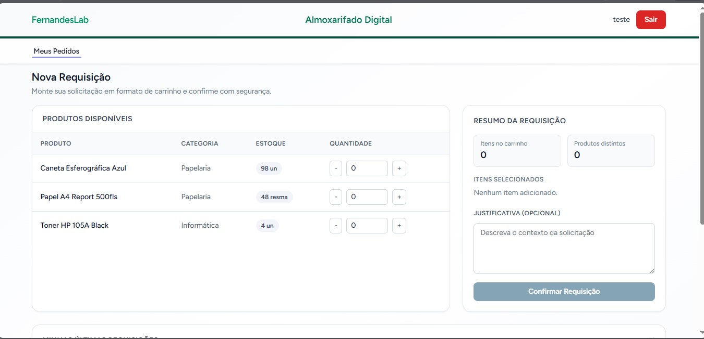
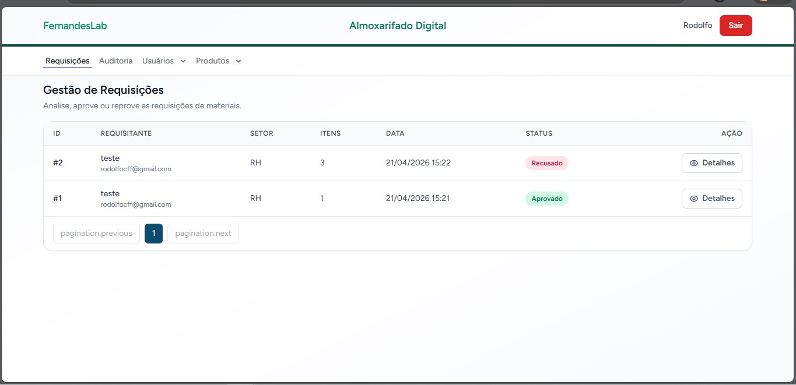

# Almoxarifado Digital - Enterprise System

Sistema para gestão de estoque e requisições, com controle de acesso baseado em perfis (RBAC).

## Visão Geral

O Almoxarifado Digital é uma aplicação corporativa para operação de almoxarifado com foco em segurança, rastreabilidade e organização de fluxo. A plataforma centraliza cadastro de usuários, produtos e rotinas de requisição com regras de acesso por perfil.

## Visualização do Sistema

<div align="center">
  <table>
    <tr>
      <td align="center">
        
        <br />
        <i>Interface de solicitações do Requisitante</i>
      </td>
      <td align="center">
        
        <br />
        <i>Painel de aprovação e controle de estoque</i>
      </td>
    </tr>
  </table>
</div>

## Destaques de Engenharia

- Aplicação explícita de **SOLID Principles** na organização de responsabilidades entre camadas.
- Práticas de **Clean Code** para legibilidade, manutenção e evolução segura.
- Separação clara de responsabilidades com **Laravel 12** no backend e **Inertia.js + Vue 3** no frontend.
- Modelo de autorização **RBAC** para garantir isolamento de permissões por tipo de usuário.
- **Service Layer Pattern** para lógica de negócio isolada e testável.
- **Trilha de Auditoria (Activity Log)** para governança de TI e conformidade (Auditável).
- **Dashboard Analítico** com métricas em tempo real e visualização em gráficos (ApexCharts).

## Funcionalidades

- Login institucional clean.
- Gerenciamento de Usuários (CRUD).
- Controle de acesso por níveis de permissão:
  - `Administrador`
  - `Almoxarife`
  - `Requisitante`
- Cadastro e gestão de Produtos com controle de estoque mínimo.
- Fluxo completo de Requisições com aprovação/reprovação e baixa automática de estoque.
- **Sistema Auditável**: Histórico detalhado de ações (criação, edição e exclusão) para usuários, produtos e requisições, visualizável em 'Logs do Sistema'.
- **Dashboard Dinâmico**: Visualização por perfil (Gestor vs. Requisitante) de métricas de consumo e saúde do estoque.

## Fluxo de Aprovação de Requisições

O sistema implementa um fluxo de aprovação de materiais em três etapas, garantindo **integridade de dados** e **consistência de estoque** através de transações de banco de dados no Service Layer.

### 1. Criação da Requisição (Requisitante)

O requisitante monta seu pedido (itens + quantidades) e envia via `RequisicaoService::criarNovaRequisicao()`:

- Valida dados de entrada (produto existe, quantidade válida).
- Verifica se há estoque disponível no momento da solicitação.
- Cria a requisição com status `pendente` e registra os itens.
- **O estoque NÃO é decrementado nesta etapa** — a baixa efetiva ocorre somente na aprovação.

### 2. Aprovação (Administrador / Almoxarife)

Ao aprovar, o `RequisicaoService::aprovar()` executa a **baixa automática de estoque** dentro de uma **transação atômica** (`DB::transaction`):

- Confirma que a requisição está com status `pendente`.
- Para cada item da requisição:
  1. Aplica `lockForUpdate()` no produto (SELECT FOR UPDATE) — previne race conditions.
  2. Verifica se `estoque_atual >= quantidade_pedida`.
  3. Se **sim**: decrementa o `estoque_atual` e registra `quantidade_entregue`.
  4. Se **não**: aborta a transação inteira (rollback) e retorna erro amigável:
     _"Erro: Produto X não possui estoque suficiente. Disponível: Y, Solicitado: Z."_
- Registra o aprovador (`aprovado_por`) e observação opcional.
- Altera o status para `aprovado`.

### 3. Reprovação (Administrador / Almoxarife)

Ao reprovar, o `RequisicaoService::reprovar()`:

- Confirma que a requisição está com status `pendente`.
- Altera o status para `recusado`.
- Grava a justificativa obrigatória do gestor em `observacao_admin`.
- **Nenhuma operação de estoque é realizada** — pois o estoque não foi decrementado na criação.

### Integridade de Dados

O sistema garante a consistência do estoque através de métodos atômicos no Service Layer:

| Aspecto | Mecanismo |
|---|---|
| **Atomicidade** | Todas as operações de estoque executam em `DB::transaction` — ou tudo acontece, ou nada é alterado |
| **Concorrência** | `lockForUpdate()` (SELECT FOR UPDATE) trava registros de produto durante a transação, prevenindo race conditions |
| **Validação** | Estoque é verificado a cada item antes da subtração; qualquer insuficiência aborta toda a transação |
| **Idempotência** | Requisições já processadas rejeitam novas tentativas de aprovação/reprovação |
| **Rastreabilidade** | Registro de aprovador e observação em cada requisição processada |

## Stack Técnica

- `PHP 8.2+`
- `Laravel 12`
- `Vue 3 (Composition API)`
- `Inertia.js`
- `Vite`
- `Tailwind CSS`
- `MySQL`

## Instalação

### 1) Clonar o repositório

```bash
git clone <URL_DO_REPOSITORIO>
cd almoxarifado_digital
```

### 2) Instalar dependências PHP

```bash
composer install
```

### 3) Instalar dependências frontend

```bash
npm install
```

### 4) Configurar o arquivo `.env`

```bash
cp .env.example .env
```

No Windows PowerShell:

```powershell
Copy-Item .env.example .env
```

### 5) Gerar a chave da aplicação

```bash
php artisan key:generate
```

### 6) Criar estrutura do banco e popular dados iniciais

```bash
php artisan migrate --seed
```

### 7) Subir frontend em desenvolvimento

```bash
npm run dev
```

## Licença

Uso interno do projeto Almoxarifado Digital.
